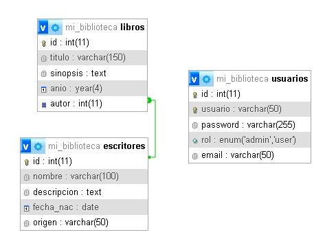

# Sistema de Gestión de Biblioteca

# Integrante

    jbackend0@gmail.com

## Descripción

Sistema web desarrollado en PHP con arquitectura MVC para la gestión de una biblioteca. Permite administrar escritores, libros y usuarios con un sistema de autenticación y roles diferenciados (administrador/usuario).

## Modelo de datos

### Diagrama Entidad-Relación (DER)

### Relaciones

- Un **Escritor** puede tener **muchos Libros** (relación 1:N)
- Un **Libro** pertenece a un **Escritor** (relación N:1)
- **Usuarios** son independientes con roles para permisos

## Despliegue

### Requisitos
- XAMPP (o Apache + MySQL + PHP 8+)

### Pasos

1. Clonar o copiar el proyecto en `htdocs/` de XAMPP
2. importar `db/mi_biblioteca.sql` desde phpMyAdmin
3. Abrir el navegador y entrar a `http://localhost/mi-biblioteca/home`

## Credenciales de administrador

Usuario = webadmin

Contraseña =  admin 

## URLs

### Públicas

- `/home` — Página principal
- `/escritores` — Listado de escritores y categorías (filtro por origen)
- `/escritores/{origen}` — Escritores filtrados por país de origen
- `/escritor/{id}` — Detalle del escritor con sus libros
- `/libros` — Listado de libros
- `/libro/{id}` — Detalle del libro
- `/login` — Iniciar sesión
- `/registro` — Crear cuenta
- `/logout` — Cerrar sesión

### Administrador (requiere login con rol admin)

- `/escritor/nuevo` — Crear escritor
- `/escritor/editar/{id}` — Editar escritor
- `/escritor/eliminar/{id}` — Eliminar escritor
- `/libro/nuevo` — Crear libro
- `/libro/editar/{id}` — Editar libro
- `/libro/eliminar/{id}` — Eliminar libro
- `/usuarios` — Ver todos los usuarios
- `/usuario/nuevo` — Crear usuario
- `/usuario/eliminar/{id}` — Eliminar usuario
